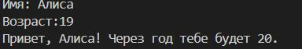
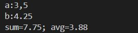
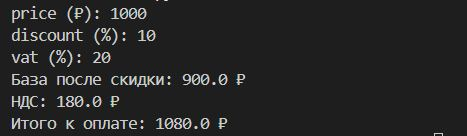
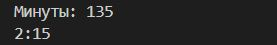
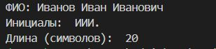

# Лабораторная работа 1
### Задание 1 
name = input("Имя: ")  
age = int(input("Возраст:"))  
print("Привет, "+ (name) +"! Через год тебе будет " + str(age + 1)+".")  
  
### Задание 2
def parse_number(s):  
    return float(s.replace(',','.'))  
a=input('a:')  
b=input('b:')  
a=parse_number(a)  
b=parse_number(b)  
sum=a+b  
avg=round((a+b)/2,2)  
print('sum='+str(sum)+'; avg='+str(avg))  
  
### Задание 3
price = int(input("price (₽): "))  
discount = int(input("discount (%): "))  
vat = int(input("vat (%): "))  

base = price * (1 - discount/100)  
vat_amount = base * (vat/100)  
total = base + vat_amount  

print('База после скидки: '+ str(base)+' ₽')  
print('НДС: ' + str(vat_amount) +' ₽')  
print("Итого к оплате: "+  str(total) +" ₽")  
  
### Задание 4
m=int(input('Минуты: '))  
hours=m//60  
minutes=m%60  
print(str(hours) +':' + str(minutes))  
  
### Задание 5
fio=str(input('ФИО: '))    
name=fio.split()  
initials=[word[0].upper() for word in name]  
print('Инициалы:',''.join(initials)+'.')  
print('Длина символов: ',len(' '.join(name)))    
     

