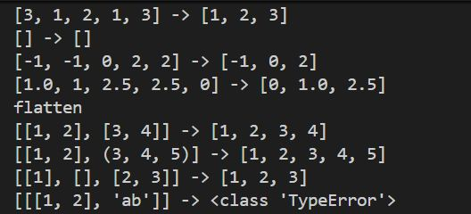
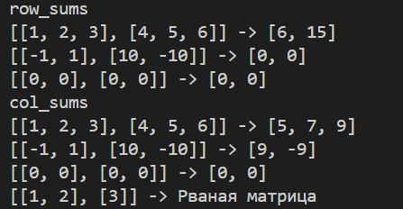
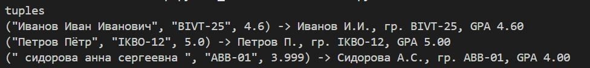

# Лабораторная работа 1
### Задание 1 
```python
name = input("Имя: ")  
age = int(input("Возраст:"))  
print("Привет, "+ (name) +"! Через год тебе будет " + str(age + 1)+".") 
``` 
  
### Задание 2
def parse_number(s):  
    return float(s.replace(',','.'))  
a=input('a:')  
b=input('b:')  
a=parse_number(a)  
b=parse_number(b)  
sum=a+b  
avg=round((a+b)/2,2)  
print('sum='+str(sum)+'; avg='+str(avg))  
  
### Задание 3
price = int(input("price (₽): "))  
discount = int(input("discount (%): "))  
vat = int(input("vat (%): "))  

base = price * (1 - discount/100)  
vat_amount = base * (vat/100)  
total = base + vat_amount  

print('База после скидки: '+ str(base)+' ₽')  
print('НДС: ' + str(vat_amount) +' ₽')  
print("Итого к оплате: "+  str(total) +" ₽")  
  
### Задание 4
m=int(input('Минуты: '))  
hours=m//60  
minutes=m%60  
print(str(hours) +':' + str(minutes))  
  
### Задание 5
 fio=str(input('ФИО: '))    
name=fio.split()    
initials=[word[0].upper() for word in name]    
print('Инициалы: ',''.join(initials)+'.')    
print('Длина (символов): ',len(' '.join(name)))    
      


# Лабораторная работа №2
### Задание №1
```Python

def min_max(nums: list[float | int]) -> tuple[float | int, float | int]:   
    if  len(nums)==0:   
        raise ValueError  
    else:  
        return min(nums), max(nums)  
#print(f"min_max\n[3, -1, 5, 5, 0] -> {min_max([3, -1, 5, 5, 0])}\n[42] -> {min_max([42])}\n[-5, -2, -9] -> {min_max([-5, -2, -9])}\n[1.5, 2, 2.0, -3.1] -> {min_max([1.5, 2, 2.0, -3.1])}\n")  
#print(f"[] -> {min_max([])}")    


def unique_sorted(nums: list[float | int]) -> list[float | int]:  
    return sorted(set(nums))  
print(f"unique_sorted\n[3, 1, 2, 1, 3] -> {unique_sorted([3, 1, 2, 1, 3])}\n[] -> {unique_sorted([])}\n[-1, -1, 0, 2, 2] -> {unique_sorted([-1, -1, 0, 2, 2])}\n[1.0, 1, 2.5, 2.5, 0] -> {unique_sorted([1.0, 1, 2.5, 2.5, 0])}")  


def flatten(mat: list[list | tuple]) -> list:  
    result=[]  
    for object in mat:  
        for item in object:  
            if type(item) is not int or not float: 
                raise TypeError  
        else:  
            for item in object:  
                result.append(item)  
    return result  
print(f"flatten\n[[1, 2], [3, 4]] -> {flatten([[1, 2], [3, 4]])}\n[[1, 2], (3, 4, 5)] -> {flatten([[1, 2], (3, 4, 5)])}\n[[1], [], [2, 3]] -> {flatten([[1], [], [2, 3]])}\n[[[1, 2], 'ab']] -> {flatten([[[1, 2], 'ab']])}")
```  


### Задание №2
```Python

def transpose(mat: list[list[float | int]]) -> list[list[float | int]]:  
    if not mat:  
        return []  
    row_len = len(mat[0])  
    if any(len(row) != row_len for row in mat):  
        raise ValueError("Рваная матрица")  
    return [[mat[i][j] for i in range(len(mat))] for j in range(row_len)]  
print(f"transpose\n[[1, 2, 3]] -> {transpose([[1, 2, 3]])}\n[[1], [2], [3]] -> {transpose([[1], [2], [3]])}\n[[1, 2], [3, 4]] -> {transpose([[1, 2], [3, 4]])}\n[] -> {transpose([])}")  
#print(f"[[1, 2], [3]] -> {transpose([[1, 2], [3]])}")  


def row_sums(mat: list[list[float | int]]) -> list[float]:  
    if not mat:  
        return []  
    row_len = len(mat[0])  
    if any(len(row) != row_len for row in mat):  
        raise ValueError("Рваная матрица")  
    return [sum(row) for row in mat]  
print(f"row_sums\n[[1, 2, 3], [4, 5, 6]] -> {row_sums([[1, 2, 3], [4, 5, 6]])}\n[[-1, 1], [10, -10]] -> {row_sums([[-1, 1], [10, -10]])}\n[[0, 0], [0, 0]] -> {row_sums([[0, 0], [0, 0]])}")  
#print(f"[[1, 2], [3]] -> {row_sums([[1, 2], [3]])}")  


def col_sums(mat: list[list[float | int]]) -> list[float]:  
    if not mat:  
        return []  
    row_len = len(mat[0])  
    if any(len(row) != row_len for row in mat):  
        raise ValueError("Рваная матрица")  
    return [sum(mat[i][j] for i in range(len(mat))) for j in range(row_len)]  
print(f"col_sums\n[[1, 2, 3], [4, 5, 6]] -> {col_sums([[1, 2, 3], [4, 5, 6]])}\n[[-1, 1], [10, -10]] -> {col_sums([[-1, 1], [10, -10]])}\n[[0, 0], [0, 0]] -> {col_sums([[0, 0], [0, 0]])}")  
print(f"[[1, 2], [3]] -> {col_sums([[1, 2], [3]])}")  
```

### Задание №3
```Python

def format_record(rec: tuple[str, str, float]) -> str:
    if not isinstance(rec, tuple):
        return TypeError
    if len(rec)!=3:
        raise ValueError
    if type(rec[2]) is not float:
        raise TypeError
    if len(rec[1])==0:
        raise ValueError
    if not isinstance(rec[0], str):
        return TypeError
    name_parts=rec[0].strip().split()
    if len(name_parts)==3:
        n1, n2, n3 = name_parts
        return f"{n1.capitalize()} {n2[0].upper()}.{n3[0].upper()}., гр. {rec[1].upper()}, GPA {rec[2]:.2f}"
    elif len(name_parts)==2:
        n1, n2 = name_parts
        return f"{n1.capitalize()} {n2[0].upper()}., гр. {rec[1].upper()}, GPA {rec[2]:.2f}"
    else:
        raise ValueError
print('tuples')
print("(\"Иванов Иван Иванович\", \"BIVT-25\", 4.6) ->", format_record(("Иванов Иван Иванович", "BIVT-25", 4.6)))
print("(\"Петров Пётр\", \"IKBO-12\", 5.0) ->", format_record(("Петров Пётр", "IKBO-12", 5.0)))
print("(\" сидорова анна сергеевна \", \"ABB-01\", 3.999) ->", format_record((" сидорова анна сергеевна ", "ABB-01", 3.999)))
```
