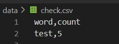
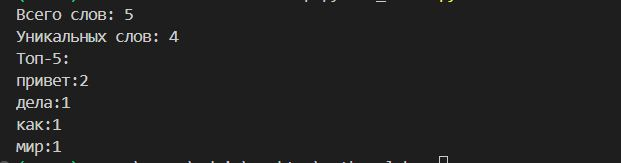

# Лабораторная работа №4
### Задание A
```Python
import sys
import os

ROOT_DIR = os.path.abspath(os.path.join(os.path.dirname(__file__), '..', '..'))
sys.path.insert(0, ROOT_DIR)

sys.path.append(os.path.join(os.path.dirname(__file__), '..'))


from lib.text import normalize, tokenize, count_freq, top_n

from pathlib import Path
import csv
from typing import Iterable, Sequence
from collections import Counter


def read_text(path: str | Path, encoding: str = "utf-8") -> str:
    p = Path(path)
    return p.read_text(encoding=encoding)


def write_csv(rows: Iterable[Sequence], path: str | Path,
              header: tuple[str, ...] | None = None) -> None:
    p = Path(path)
    rows = list(rows)
    with p.open("w", newline="", encoding="utf-8") as f:
        w = csv.writer(f)
        if header is not None:
            w.writerow(header)
        for r in rows:
            w.writerow(r)


def frequencies_from_text(text: str) -> dict[str, int]:
    tokens = tokenize(normalize(text))
    return Counter(tokens) 


def sorted_word_counts(freq: dict[str, int]) -> list[tuple[str, int]]:
    return sorted(freq.items(), key=lambda kv: (-kv[1], kv[0]))


txt = read_text("data/input.txt") 
data=[i for i in top_n(count_freq(tokenize(normalize(txt))),n=5)]
write_csv(
    header=("word","count"),
    rows=data,
    path = "data/check.csv" ,
)

 ```


 ### Задание В
```Python
import sys
import os
from pathlib import Path

ROOT_DIR = os.path.abspath(os.path.join(os.path.dirname(__file__), '..', '..'))
sys.path.insert(0, ROOT_DIR)

sys.path.append(os.path.join(os.path.dirname(__file__), '..'))

from lib.text import normalize, tokenize, count_freq, top_n

from lab04.io_txt_csv import read_text, write_csv

PROJECT_ROOT = Path(__file__).parent.parent.parent


input_path = PROJECT_ROOT / "data" / "input.txt"
output_path = PROJECT_ROOT / "data" / "report.csv"
p = read_text(input_path)
norm_p=normalize(p)
tokens=tokenize(norm_p)
count_word=count_freq(tokens)
top=top_n(count_freq(tokenize(normalize(p))))

write_csv(top, output_path, ["word", "count"])

print("Всего слов:", len(tokens))
print("Уникальных слов:", len(count_word))
print("Топ-5:")
for x,y in top[:5]:
    print(f'{x}:{y}')
    ```

 

