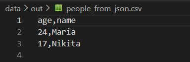
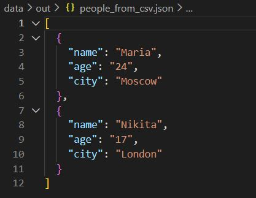
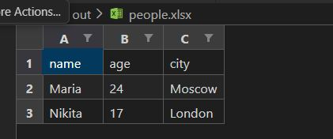

# Лабораторная работа №5
### Задание A
```Python
import json
import csv
from pathlib import Path

def json_to_csv(json_path: str, csv_path: str) -> None:
    if Path(json_path).is_absolute():
        raise ValueError("путь к JSON должен быть относительным")
    if Path(csv_path).is_absolute():
        raise ValueError("путь к CSV должен быть относительным")
    
    if not json_path.lower().endswith('.json'):
        raise ValueError("нэ JSON")
    if not csv_path.lower().endswith('.csv'):
        raise ValueError("нэ CSV")
    
    if not Path(json_path).exists():
        raise FileNotFoundError(f"файл не найден: {json_path}")
    
    with open(json_path, 'r', encoding='utf-8') as f:
        data = json.load(f)
    
    if not data:
        raise ValueError("пустой JSON")
    if not isinstance(data, list):
        raise ValueError("JSON должен быть списком")
    if not all(isinstance(item, dict) for item in data):
        raise ValueError("все элементы должны быть словарями")
    
    fields = sorted(data[0].keys())
    
    Path(csv_path).parent.mkdir(parents=True, exist_ok=True)
    with open(csv_path, 'w', newline='', encoding='utf-8') as f:
        writer = csv.DictWriter(f, fieldnames=fields)
        writer.writeheader()
        for row in data:
            complete_row = {field: str(row.get(field, '')) for field in fields}
            writer.writerow(complete_row)

def csv_to_json(csv_path: str, json_path: str) -> None:
    if not csv_path.lower().endswith('.csv'):
        raise ValueError("нэ CSV")
    if not json_path.lower().endswith('.json'):
        raise ValueError("нэ JSON")
    
    if not Path(csv_path).exists():
        raise FileNotFoundError(f"файл не найден: {csv_path}")
    
    with open(csv_path, 'r', encoding='utf-8') as f:
        data = list(csv.DictReader(f))
    
    if not data:
        raise ValueError("пустой CSV")
    
    Path(json_path).parent.mkdir(parents=True, exist_ok=True)
    with open(json_path, 'w', encoding='utf-8') as f:
        json.dump(data, f, ensure_ascii=False, indent=2)

if __name__ == "__main__":
    Path("data/out").mkdir(parents=True, exist_ok=True)
    
    json_to_csv("data/samples/people.json", "data/out/people_from_json.csv")
    csv_to_json("data/samples/people.csv", "data/out/people_from_csv.json")

```
    
    
### Задание В
```Python
 import csv
from pathlib import Path
from openpyxl import Workbook
from openpyxl.utils import get_column_letter

def csv_to_xlsx(csv_path: str, xlsx_path: str) -> None:
    if Path(csv_path).is_absolute() or Path(xlsx_path).is_absolute():
        raise ValueError("пути должны быть относительными")
    if not csv_path.endswith('.csv') or not xlsx_path.endswith('.xlsx'):
        raise ValueError("неверные расширения файлов")
    if not Path(csv_path).exists():
        raise FileNotFoundError(f"файл не найден: {csv_path}")
    
    with open(csv_path, "r", encoding="utf-8") as f:
        rows = list(csv.reader(f))
    
    if not rows or not any(rows[0]):
        raise ValueError("пустой CSV или нет заголовка")
    
    wb = Workbook()
    ws = wb.active
    ws.title = "Sheet1"
    
    max_lengths = []
    for row in rows:
        ws.append(row)
        for i, value in enumerate(row):
            if i >= len(max_lengths):
                max_lengths.append(0)
            max_lengths[i] = max(max_lengths[i], len(str(value or "")))
    
    for i, length in enumerate(max_lengths, 1):
        ws.column_dimensions[get_column_letter(i)].width = max(length + 2, 8)
    
    Path(xlsx_path).parent.mkdir(parents=True, exist_ok=True)
    wb.save(xlsx_path)

if __name__ == "__main__":
    Path("data/out").mkdir(parents=True, exist_ok=True)
    csv_to_xlsx("data/samples/people.csv", "data/out/people.xlsx")
 ```
    