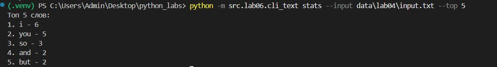
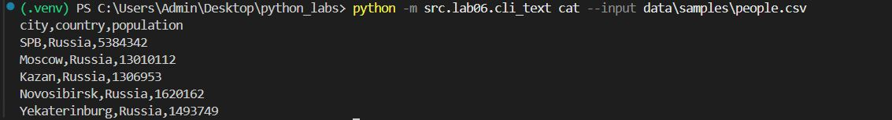
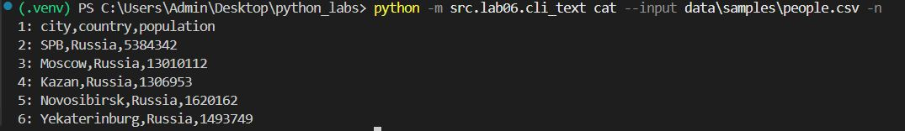
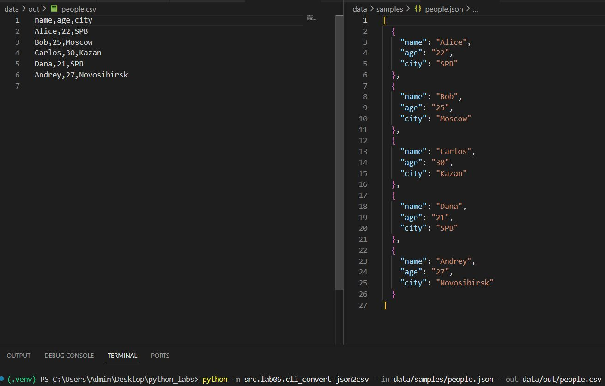
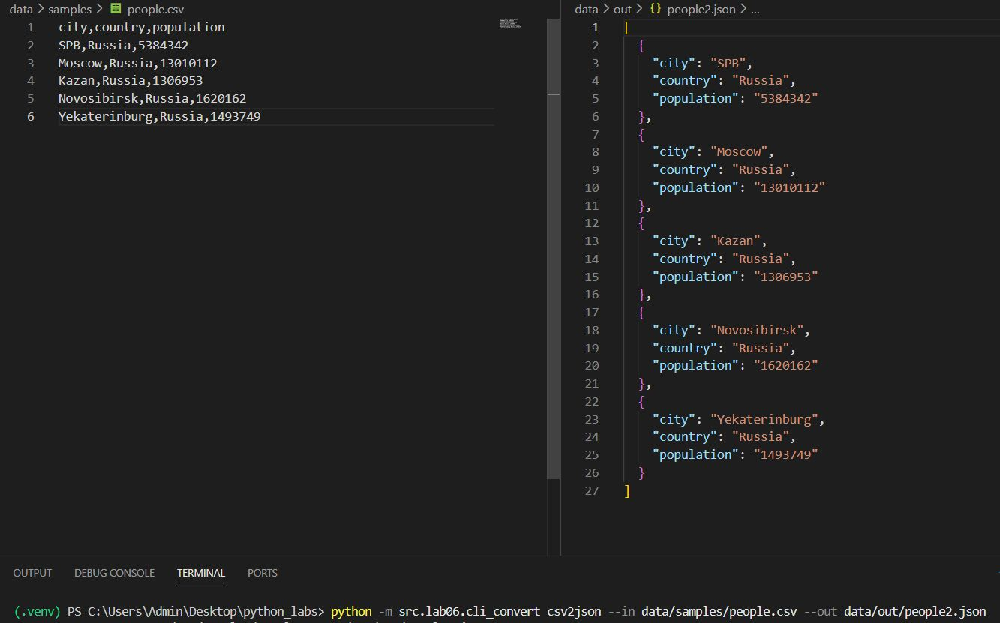
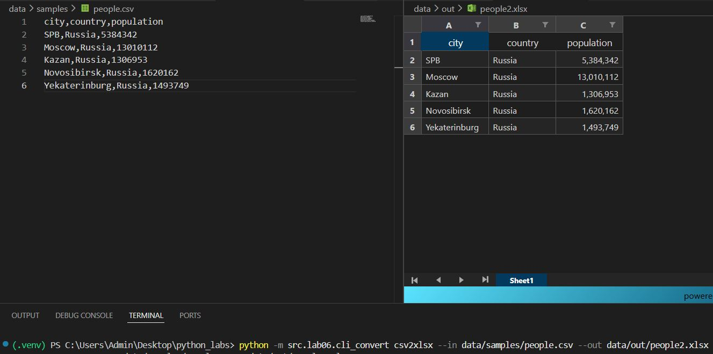

# Лабораторная работа №6
### Задание А
```Python
import argparse
from pathlib import Path
import re
from collections import Counter

def normalize(text):
    """Нормализация текста"""
    text = text.lower()
    text = re.sub(r'\s+', ' ', text)
    return text.strip()

def tokenize(text):
    """Разделение на слова"""
    return re.findall(r'\b[a-zа-яё0-9]+\b', text, re.IGNORECASE)

def count_freq(words):
    """Подсчет частоты"""
    freq = {}
    for word in words:
        freq[word] = freq.get(word, 0) + 1
    return freq

def top_n(freq, n=5):
    """Топ N слов"""
    sorted_items = sorted(freq.items(), key=lambda x: (-x[1], x[0]))
    return sorted_items[:n]


def main():
    # создание объекта парсера с описанием программы
    parser = argparse.ArgumentParser(description="CLI-утилиты лабораторной №6")

    subparsers = parser.add_subparsers(dest="command", help="Доступные команды", required=True)

    # Сначала создаем парсер для stats
    stats_parser = subparsers.add_parser("stats", help="Частоты слов в тексте")
    stats_parser.add_argument("--input", required=True, help="Входной текстовый файл")
    stats_parser.add_argument(
        "--top",
        type=int,
        default=5,
        help="Количество топовых слов (по умолчанию: 5)",
    )
    
    # Затем создаем парсер для cat
    cat_parser = subparsers.add_parser("cat", help="Вывод содержимого файла")
    cat_parser.add_argument("--input", required=True, help="Путь к входному файлу")
    cat_parser.add_argument("-n", action="store_true", help="Нумеровать строки")

    args = parser.parse_args()

    # Проверяем команду и обрабатываем соответствующие аргументы
    if args.command == "cat":
        file = Path(args.input)
        if not file.exists():
            parser.error(f"Файл '{args.input}' не найден")
        
        # реализация команды cat
        with open(file, "r", encoding="utf-8") as f:
            number = 1
            for row in f:
                row = row.rstrip("\n")
                if args.n:  # если указан флаг n -> печатаем пронумерованные строки
                    print(f"{number}: {row}")
                    number += 1
                else:
                    print(row)

    elif args.command == "stats":
        file = Path(args.input)
        if not file.exists():
            parser.error(f"Файл '{args.input}' не найден")
        
        # реализация команды stats
        with open(file, "r", encoding="utf-8") as f:
            data = f.read()
        
        # Нормализуем текст
        normalized = normalize(data)
        # Токенизируем
        tokens = tokenize(normalized)
        # Считаем частоту
        freq = count_freq(tokens)
        # Получаем топ слов
        top = top_n(freq, n=args.top)

        # выводим топ слов
        print(f"Топ {args.top} слов:")
        for i, (word, count) in enumerate(top, 1):
            print(f"{i}. {word} - {count}")


if __name__ == "__main__":
    main()
```




### Задание В
```Python
#!/usr/bin/env python3
"""
Конвертер данных CLI
Команды: json2csv, csv2json, csv2xlsx
"""

import argparse
from pathlib import Path
import sys
import json
import csv
import pandas as pd


def json_to_csv(input_file: str, output_file: str):
    """Конвертация JSON в CSV"""
    try:
        with open(input_file, 'r', encoding='utf-8') as f:
            data = json.load(f)
        
        # Проверяем, что данные - список словарей
        if not isinstance(data, list):
            data = [data]
        
        if not data:
            raise ValueError("JSON файл пустой")
        
        # Получаем заголовки из первого элемента
        fieldnames = list(data[0].keys())
        
        with open(output_file, 'w', newline='', encoding='utf-8') as f:
            writer = csv.DictWriter(f, fieldnames=fieldnames)
            writer.writeheader()
            writer.writerows(data)
        
        print(f"Конвертация завершена: {input_file} → {output_file}")
        
    except Exception as e:
        sys.stderr.write(f"Ошибка конвертации JSON→CSV: {e}\n")
        sys.exit(1)


def csv_to_json(input_file: str, output_file: str, indent: int = 2):
    """Конвертация CSV в JSON"""
    try:
        data = []
        with open(input_file, 'r', encoding='utf-8') as f:
            reader = csv.DictReader(f)
            for row in reader:
                data.append(row)
        
        with open(output_file, 'w', encoding='utf-8') as f:
            json.dump(data, f, ensure_ascii=False, indent=indent)
        
        print(f"Конвертация завершена: {input_file} → {output_file}")
        
    except Exception as e:
        sys.stderr.write(f"Ошибка конвертации CSV→JSON: {e}\n")
        sys.exit(1)


def csv_to_xlsx(input_file: str, output_file: str, sheet_name: str = "Sheet1"):
    """Конвертация CSV в XLSX"""
    try:
        df = pd.read_csv(input_file)
        df.to_excel(output_file, index=False, sheet_name=sheet_name)
        
        print(f"Конвертация завершена: {input_file} → {output_file}")
        
    except Exception as e:
        sys.stderr.write(f"Ошибка конвертации CSV→XLSX: {e}\n")
        sys.exit(1)


def main():
    parser = argparse.ArgumentParser(
        description="Конвертер JSON↔CSV, CSV→XLSX",
        formatter_class=argparse.RawDescriptionHelpFormatter
    )
    
    subparsers = parser.add_subparsers(
        dest="command",
        title="доступные команды",
        metavar=""
    )
    subparsers.required = True
    
    # Команда json2csv
    json2csv_parser = subparsers.add_parser(
        "json2csv",
        help="Конвертировать JSON в CSV",
        description="Преобразует JSON файл в CSV формат"
    )
    json2csv_parser.add_argument(
        "--in",
        dest="input",
        required=True,
        help="Путь к входному JSON"
    )
    json2csv_parser.add_argument(
        "--out",
        dest="output",
        required=True,
        help="Путь к выходному CSV"
    )
    
    # Команда csv2json
    csv2json_parser = subparsers.add_parser(
        "csv2json",
        help="Конвертировать CSV в JSON",
        description="Преобразует CSV файл в JSON формат"
    )
    csv2json_parser.add_argument(
        "--in",
        dest="input",
        required=True,
        help="Путь к входному CSV"
    )
    csv2json_parser.add_argument(
        "--out",
        dest="output",
        required=True,
        help="Путь к выходному JSON"
    )
    csv2json_parser.add_argument(
        "--indent",
        type=int,
        default=2,
        help="Отступ в JSON файле (по умолчанию: 2)"
    )
    
    # Команда csv2xlsx
    csv2xlsx_parser = subparsers.add_parser(
        "csv2xlsx",
        help="Конвертировать CSV в XLSX",
        description="Преобразует CSV файл в Excel формат"
    )
    csv2xlsx_parser.add_argument(
        "--in",
        dest="input",
        required=True,
        help="Путь к входному CSV"
    )
    csv2xlsx_parser.add_argument(
        "--out",
        dest="output",
        required=True,
        help="Путь к выходному XLSX"
    )
    csv2xlsx_parser.add_argument(
        "--sheet",
        default="Sheet1",
        help="Название листа в Excel (по умолчанию: Sheet1)"
    )
    
    args = parser.parse_args()
    
    # Проверяем существование входного файла
    if not Path(args.input).exists():
        sys.stderr.write(f"Ошибка: входной файл '{args.input}' не найден\n")
        sys.exit(1)
    
    # Выполняем соответствующую команду
    if args.command == "json2csv":
        json_to_csv(args.input, args.output)
    elif args.command == "csv2json":
        csv_to_json(args.input, args.output, getattr(args, 'indent', 2))
    elif args.command == "csv2xlsx":
        csv_to_xlsx(args.input, args.output, getattr(args, 'sheet', 'Sheet1'))


if __name__ == "__main__":
    main()
```



