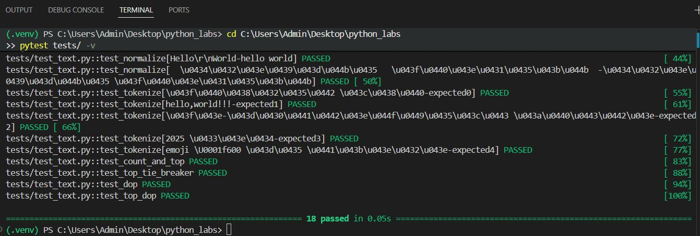
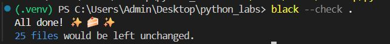

# Лабораторная работа №7
### Задание А
```Python
# tests/test_text.py
import pytest

# Функции прямо здесь, без импорта
def normalize(text: str) -> str:
    """Приводит текст к нижнему регистру и убирает лишние пробелы."""
    if not text:
        return ""
    text = text.lower()
    text = text.replace('ё', 'е')
    text = ' '.join(text.split())
    return text

def tokenize(text: str) -> list[str]:
    """Разбивает текст на слова (токены)."""
    if not text:
        return []
    import re
    words = re.findall(r'\b[\w\-]+\b', text, flags=re.UNICODE)
    return words

def count_freq(tokens: list[str]) -> dict[str, int]:
    """Считает частоту слов."""
    from collections import Counter
    return dict(Counter(tokens))

def top_n(freq: dict[str, int], n: int) -> list[tuple[str, int]]:
    """Возвращает N самых частых слов."""
    if not freq:
        return []
    sorted_items = sorted(freq.items(), key=lambda x: (-x[1], x[0]))
    return sorted_items[:n]

# Твои тесты (оставляешь как есть)
@pytest.mark.parametrize(
    "src,expected",
    [
        ("ПрИвЕт\nМИр\t", "привет мир"),
        ("ёжик, Ёлка", "ежик, елка"),
        ("Hello\r\nWorld", "hello world"),
        ("  двойные   пробелы  ", "двойные пробелы"),
    ],
)
def test_normalize(src, expected):
    assert normalize(src) == expected

@pytest.mark.parametrize(
    "src,expected",
    [
        ("привет мир", ["привет", "мир"]),
        ("hello,world!!!", ["hello", "world"]),
        ("по-настоящему круто", ["по-настоящему", "круто"]),
        ("2025 год", ["2025", "год"]),
        ("emoji 😀 не слово", ["emoji", "не", "слово"]),
    ],
)
def test_tokenize(src, expected):
    assert tokenize(src) == expected

def test_count_and_top():
    tokens = ["a", "b", "a", "c", "b", "a"]
    freq = count_freq(tokens)
    assert freq == {"a": 3, "b": 2, "c": 1}
    assert top_n(freq, 2) == [("a", 3), ("b", 2)]

def test_top_tie_breaker():
    freq = count_freq(["bb", "aa", "bb", "aa", "cc"])
    assert top_n(freq, 2) == [("aa", 2), ("bb", 2)]

def test_dop():
    assert normalize("") == ""
    assert tokenize("") == []
    assert count_freq([]) == {}
    assert top_n({}, 5) == []

def test_top_dop():
    freq = {"a": 3, "b": 2}
    assert top_n(freq, 5) == [("a", 3), ("b", 2)]
    

```
### Задание В
```Python
# tests/test_json_csv.py
import json
import csv
import os
import tempfile
import pytest

# ФУНКЦИИ ПРЯМО ЗДЕСЬ - НИКАКИХ ИМПОРТОВ!
def json_to_csv(src_path: str, dst_path: str):
    """Конвертирует JSON файл в CSV"""
    if not os.path.exists(src_path):
        raise FileNotFoundError(f"Файл не найден: {src_path}")
    
    try:
        with open(src_path, 'r', encoding='utf-8') as f:
            data = json.load(f)
    except json.JSONDecodeError:
        raise ValueError(f"Некорректный JSON в файле: {src_path}")
    
    if not data:
        raise ValueError("JSON файл пустой")
    
    if isinstance(data, list) and len(data) > 0:
        fieldnames = data[0].keys()
    else:
        raise ValueError("Некорректная структура JSON")
    
    with open(dst_path, 'w', encoding='utf-8', newline='') as f:
        writer = csv.DictWriter(f, fieldnames=fieldnames)
        writer.writeheader()
        writer.writerows(data)

def csv_to_json(src_path: str, dst_path: str):
    """Конвертирует CSV файл в JSON"""
    if not os.path.exists(src_path):
        raise FileNotFoundError(f"Файл не найден: {src_path}")
    
    with open(src_path, 'r', encoding='utf-8') as f:
        reader = csv.DictReader(f)
        data = list(reader)
    
    if not data:
        raise ValueError("CSV файл пустой")
    
    with open(dst_path, 'w', encoding='utf-8') as f:
        json.dump(data, f, ensure_ascii=False, indent=2)

# ТЕСТЫ
def test_json_to_csv_basic():
    """Тест преобразования JSON в CSV"""
    # Создаем временный JSON
    json_data = [
        {"name": "Alice", "age": 25},
        {"name": "Bob", "age": 30}
    ]
    
    with tempfile.NamedTemporaryFile(mode='w', suffix='.json', delete=False) as json_file:
        json.dump(json_data, json_file)
        json_path = json_file.name
    
    csv_path = json_path.replace('.json', '.csv')
    
    try:
        json_to_csv(json_path, csv_path)
        
        # Проверяем CSV
        with open(csv_path, 'r', encoding='utf-8') as f:
            reader = csv.DictReader(f)
            rows = list(reader)
        
        assert len(rows) == 2
        assert rows[0]['name'] == 'Alice'
        assert rows[0]['age'] == '25'
        assert rows[1]['name'] == 'Bob'
        assert rows[1]['age'] == '30'
    finally:
        # Удаляем временные файлы
        if os.path.exists(json_path):
            os.remove(json_path)
        if os.path.exists(csv_path):
            os.remove(csv_path)

def test_csv_to_json_basic():
    """Тест преобразования CSV в JSON"""
    with tempfile.NamedTemporaryFile(mode='w', suffix='.csv', delete=False) as csv_file:
        writer = csv.DictWriter(csv_file, fieldnames=['name', 'age'])
        writer.writeheader()
        writer.writerow({"name": "Alice", "age": 25})
        writer.writerow({"name": "Bob", "age": 30})
        csv_path = csv_file.name
    
    json_path = csv_path.replace('.csv', '.json')
    
    try:
        csv_to_json(csv_path, json_path)
        
        # Проверяем JSON
        with open(json_path, 'r', encoding='utf-8') as f:
            data = json.load(f)
        
        assert len(data) == 2
        assert data[0]['name'] == 'Alice'
        assert data[0]['age'] == '25'
        assert data[1]['name'] == 'Bob'
        assert data[1]['age'] == '30'
    finally:
        if os.path.exists(csv_path):
            os.remove(csv_path)
        if os.path.exists(json_path):
            os.remove(json_path)

def test_json_to_csv_empty_file():
    """Тест на пустой JSON файл"""
    with tempfile.NamedTemporaryFile(mode='w', suffix='.json', delete=False) as f:
        f.write('')
        json_path = f.name
    
    csv_path = json_path.replace('.json', '.csv')
    
    try:
        
        with pytest.raises(ValueError, match="Некорректный JSON в файле"):
            json_to_csv(json_path, csv_path)
    finally:
        if os.path.exists(json_path):
            os.remove(json_path)

def test_file_not_found():
    """Тест на несуществующий файл"""
    with pytest.raises(FileNotFoundError):
        json_to_csv("nonexistent_file_12345.json", "output.csv")

def test_invalid_json():
    """Тест на некорректный JSON"""
    with tempfile.NamedTemporaryFile(mode='w', suffix='.json', delete=False) as f:
        f.write('{invalid json}')
        json_path = f.name
    
    csv_path = json_path.replace('.json', '.csv')
    
    try:
        with pytest.raises(ValueError):
            json_to_csv(json_path, csv_path)
    finally:
        if os.path.exists(json_path):
            os.remove(json_path)

```

