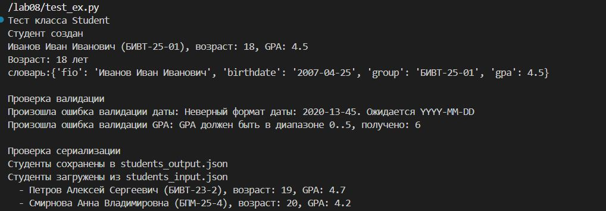
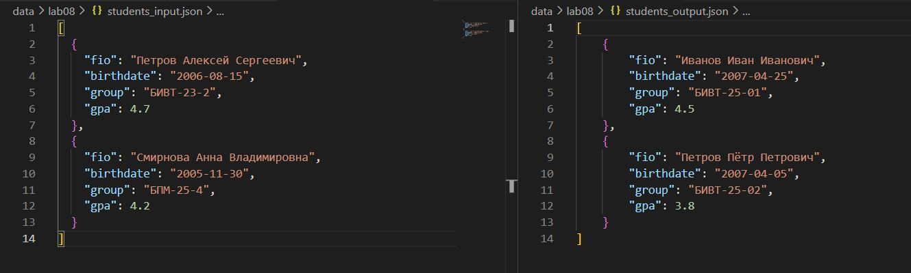

# Лабораторная работа №8
### Задание А(models.py)
```Python
from datetime import datetime, date
from dataclasses import dataclass

@dataclass
class Student:
    fio: str
    birthdate: str
    group: str
    gpa: float

    def __post_init__(self):
        # Валидация birthdate
        try:
            datetime.strptime(self.birthdate, "%Y-%m-%d")
        except ValueError:
            raise ValueError(f"Неверный формат даты: {self.birthdate}. Ожидается YYYY-MM-DD")

        # Валидация GPA
        if not (0 <= self.gpa <= 5):
            raise ValueError(f"GPA должен быть в диапазоне 0..5, получено: {self.gpa}")

    # Возраст студента
    def age(self) -> int:
        birth = datetime.strptime(self.birthdate, "%Y-%m-%d").date()
        today = date.today()
        years = today.year - birth.year
        if (today.month, today.day) < (birth.month, birth.day):
            years -= 1
        return years

    # Сериализация
    def to_dict(self) -> dict:
        return {
            "fio": self.fio,
            "birthdate": self.birthdate,
            "group": self.group,
            "gpa": self.gpa
        }

    # Десериализация
    @classmethod
    def from_dict(cls, d: dict):
        return cls(
            fio=d["fio"],
            birthdate=d["birthdate"],
            group=d["group"],
            gpa=d["gpa"]
        )

    def __str__(self):
        # ВЫВОДИМ ПОЛНОЕ ФИО 
        return f"{self.fio} ({self.group}), возраст: {self.age()}, GPA: {self.gpa}"
```
### Задание В(serialize.py)
```Python
import json
import os
from .models import Student

def students_to_json(students, path):
    """Сохранение списка студентов в JSON файл."""
    data = [s.to_dict() for s in students]
    
    # Создаем директорию, если она не существует
    os.makedirs(os.path.dirname(path), exist_ok=True)
    
    with open(path, "w", encoding="utf-8") as f:
        json.dump(data, f, ensure_ascii=False, indent=4)
    
    print(f"Студенты сохранены в {path}")

def students_from_json(path) -> list[Student]:
    """Загрузка студентов из JSON файла."""
    try:
        with open(path, "r", encoding="utf-8") as f:
            raw = json.load(f)
    except FileNotFoundError:
        print(f"Файл {path} не найден")
        return []
    
    result = []
    for d in raw:
        try:
            result.append(Student.from_dict(d))
        except ValueError as e:
            print(f"Ошибка при создании студента: {e}")
    
    print(f"Студенты загружены из {path}")
    return result
```

